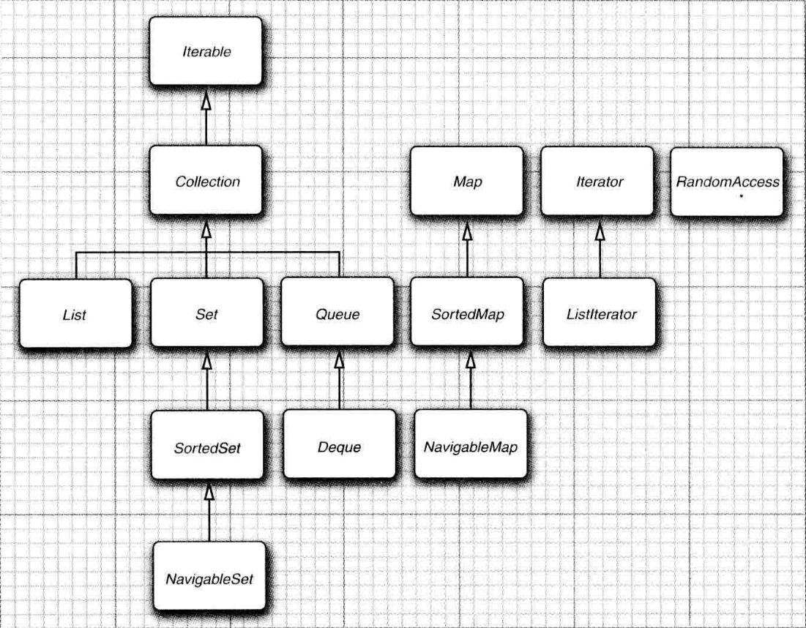
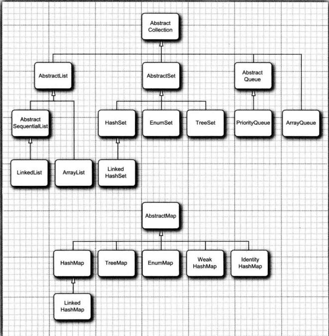

# Java

## stdin and stdout

### stdin
1. An object 'Scanner' is used for input and output. `Scanner scan = new Scanner(System.in)`
2. function scan.next() 
    1. ignore the blank space before valid input.
    2. It ends with ' ' or '\n'
3. function scan.nextLine()
    1. include all the blank spaces.
    2. only ends with '\n'.
4. nextInt(), nextDouble(), ... all of them do not read in '\n'.
5. function hasNextLine(), hasNext()
    1. whether it reaches EOF.

### stdout
1. System.out.println()
    1. println(10 + 'a') is 107, but println(10 + "a") is 10a.
2. System.out.printf()
    1. It is the same as printf() in C.
    2. "%04d" means that fill the int to four digits with '0'
    3. "%-15s" means start at the left side and fill the string to 15 digits

### Number format

    ```Java
    NumberFormat.getInstance().format(myNumber); 23,323.332
    //currency in different country
    NumberFormat.getCurrencyInstance(Locale.CHINA).format(myNumber); ￥23,323.33
    
    NumberFormat.getNumberInstance().format(myNumber); 23,323.332
    NumberFormat.getPercentInstance().format(test); 34%
    ```


## Collections

#### Iterator

1. interface details
```Java
public interface Iterator<E> {
    E next () ;
    boolean hasNext();
    // remove the lastest element 
    void remove 0 ;
    default void forEachRemaining ( Consumer<? super E> action ) ;
}
```

2. foreach() and for() would automatically call:
```Java
while(c.hasNext()){
    c = c.next();
    // operation
}
```

3. **Conflicts**: One iterator may modify the collection, and the other existing iterators may throw exceptions. **Solution**: Implement read only iterator.

4. Java interface structure
   

   

#### Collection

1. Collection is a basic interface of a set of elements with basic methods. We usually extends **AbstractCollection** abstract class which has already implemented the basic methods.

2. **Unordered**. It has methods for add() remove() ... but not for random access.

3. ```Java
   public abstract class AbstractedCollection<E> implements Collection<E>{
       // need further implementation for iterator() 
       public abstract Iterator< E > iterator ();
       
   	public boolean contains ( Object obj ){
           for ( E element : this ) // calls iteratorO
           if ( element.equals (obj))
           return true ;
           return false ;
       }
   }
   ```

#### List

1. List is an **ordered** collection. It has methods for random access like get(), set(), add(idx)...
2. **Iterator interface** does not have add() because it is **unordered**. Therefore, it applied **ListIterator** which has add() method and add the new element to the end of the list.
3. **ListIterator**
   1. It can traverse in reverse. `hasprevious(); previous()`
   2. `add()` would add an element **before** the current iterator.  

#### ArrayList

1. constructor

    1. The arrayList is hard to initialize values by constructor, better add value one by one.

2. modifiers
    1. indexing:
        It can not use [], but use arr.get(int index)
    2. set(int index, E newValue)

3. toArray()
    1. al.toArray()
        It returns object not any other data type
        `Object[] objects = al.toArray();`
        otherwise need to typecast
        `Integer[] b = (Integer[]) al.toArray()`
    2. al.toArray(tell the return type)
        ```
        Integer[] arr = new Integer[al.size()]; 
        arr = al.toArray(arr); 
        ```

4. Tips

   1. ArrayList is **unsynchronized** but Vector is **synchronized**. Therefore, ArrayList is faster than Vector when no multi-threading is needed. 

#### View

1. View is the reference of **interface**, which is normally **unmodified**.

   ```java
   Collections.unmodifiedCollection();
   Collections.unmodifiedList();
   ```

2. Synchronise a collection or set.

   ```java
   Map<String,Employee〉map = Collections.synchronizedMap (new HashMap< String,Employee>);
   ```

3. Check the type and exception.

   ```java
   ArrayList <String> strings = new ArrayList();
   List<String> safestrings = Collections checkedList (strings ,String.class);
   ArrayList rawList = safestrings ;
   rawList.add( new Date() ) ; // checked list throws a ClassCastException
   
   rawList = strings;
   rawList.add(new Date()); // it would not throws an exception
   
   ```

   


## String

1. charAt()

    1. String does not have [] indexing, only has charAt()

2. int indexOf(char ch, int fromidx)/(str, fromidx)/(char)/(str)

    1. Find the index of first corresponding content. If does not exist, then return -1.

3. String.valueOf()

    1. Convert object to String.

4. **String.format()**
    1. string or char

        1. `String str = String.format("%-7s", "hello);`

    2. int
        1. '-': align-left
        2. '0': fill with 0
        3. '+': result will contain '+' or '-'
        4. '#': show '0' or '0x' if it's hex or ox number
        5. "%x": hex, "%o": ox

    3. float
        1. "%f"
        2. "%a": hex number
        3. "%e": in exponential 
        4. "%g"

    4. Time
        1. it must have "%t"
        ```
        Date now = new Date();
        String str = String.format("%tF", now);
        ```

5. str.equals(), str.equalsIgnoreCase(), compareTo(), startsWith(), endsWith().

6. str.substring(int start, int end)

7. str.replace(String, String): replace all the matching substring.

8. **StringBuffer**
    1. StringBuffer is synchronized but StringBuilder is not.

    2. The methods that is beyond String
        1. append(String str)
        2. reverse()
        3. delete(int start, int end)
        4. insert(int offset, String str)
        5. replace(int start, int end, String str)
        6. toString()


## HashSet

1. constructor

    1. The data type is not necessary in the constructor. Both `HashSet hs = new HashSet();` and `HashSet<String> hs = new HashSet<String>();` are true;

2. modifiers
    ```java
    1. boolean add(E e): insert if not exist
    2. void clear()
    3. boolean contains(object o)
    4. isEmpty()
    5. iterator()
    6. boolean remove(object o)
    7. size()
    8. getOrDefault(key, default value)
    ```


## Map

1. Traversal Map
    ```Java
    //第一种：普遍使用，二次取值
    System.out.println("通过Map.keySet遍历key和value：");
    for (String key : map.keySet()) {
    System.out.println("key= "+ key + " and value= " + map.get(key));
    }
    
    //第二种
    System.out.println("通过Map.entrySet使用iterator遍历key和value：");
    Iterator<Map.Entry<String, String>> it = map.entrySet().iterator();
    while (it.hasNext()) {
    Map.Entry<String, String> entry = it.next();
    System.out.println("key= " + entry.getKey() + " and value= " + entry.getValue());
    }
    
    //第三种：推荐，尤其是容量大时
    System.out.println("通过Map.entrySet遍历key和value");
    for (Map.Entry<String, String> entry : map.entrySet()) {
    System.out.println("key= " + entry.getKey() + " and value= " + entry.getValue());
    }
    
    //第四种
    System.out.println("通过Map.values()遍历所有的value，但不能遍历key");
    for (String v : map.values()) {
    System.out.println("value= " + v);
    ```

2. modifiers

    ```java
    1. containsKey(object key)
    2. containsValue(object value)
    3. Set<Map.Entry<K,V>> entrySet()
    4. equals(obj)
    5. get(object key): get the value
    6. isEmpty()
    7. keySet()
    8. put(K key, V value)
    9. putAll(Map<> m): put the whole map into it
    10. remove(object key)
    11. Collection<V> values()
    ```

## List

1. access element by get() not [].

2. **All the objects in the List is a reference to an specific object**
    ```Java
    ArrayList<HashSet<Integer>> a = new ArrayList<>(), b = new ArrayList<>();
    HashSet<Integer> tmp = new HashSet<>();
    a.add(tmp);
    b.add(tmp);

    tmp.add(1);
    tmp.add(2);
    for(HashSet<Integer> ele:b)
        for(int i:ele){
            System.out.println(i);
        }
    ```
    The output of a and b will both be "1 2".

## Arrays

1. Arrays.copyOfRange(Object[] src, int from, int to)
    obtain the sub array from source

2. Arrays.sort(array, comparator)


## Copy

1. Shallow
    1. traversal
        ```Java
        List<Person> destList=new ArrayList<Person>(srcList.size());  
        for(Person p : srcList){  
            destList.add(p);  
        }  
        ```
    2. constructor
        ```Java
        List<Person> destList=new ArrayList<Person>(srcList);  
        ```
    3. addAll()
        ```Java
        List<Person> destList=new ArrayList<Person>();  
        destList.addAll(srcList);  
        ```
    4. System.arraycopy()
        ```Java
        Person[] srcPersons=srcList.toArray(new Person[0]);  
        Person[] destPersons=new Person[srcPersons.length];  
        System.arraycopy(srcPersons, 0, destPersons, 0, srcPersons.length); 

        ```

2. Deep
    1. use the clone()
        you can use the default clone() if it has. but need to typecast.
        ```Java
        ArrayList<Integer> a = new ArrayList<>();
        ArrayList<Integer> cpy = (ArrayList<Integer>) a.clone();
        ```
        If the class does not have clone(), then implements Cloneable
        ```Java
        public class A implements Cloneable {   
            public String name[];   

            public A(){   
                name=new String[2];   
            }   

            public Object clone() {   
                A o = null;   
                try {   
                    o = (A) super.clone();   
                } catch (CloneNotSupportedException e) {   
                    e.printStackTrace();   
                }   
                return o;   
            }   
        }
        ```

## Regular Expression

1. First new Object Pattern, but it does not has constructor, need to use Pattern.compile()
    `Pattern p = Pattern.compile(REGEX)`
2. Object Matcher to complete the matches
    `Matcher m = p.matcher(INPUT);`
3. Matcher Methods
    1. Indexing
        1. boolean find()
            if it finds the matching substring to REGEX.
        2. boolean find(int start)
            start at the given offset to find the matching substring
        3. boolean matches()
            if the whole string matches REGEX
        4. int start(), int end()
            return the starting(ending) index of last finding result
    2. Replacing
        1. **Matcher appendReplacement(StringBuffer sb, String replacement)**
            append the replaced substring starting from the last finding result to sb(StringBuffer).
        2. StringBuffer appendTail(StringBuffer sb)
            append the content starting from the last finding result to sb(StringBuffer).
        3. replaceAll(String replace)
        4. replaceFirst(String replace)
    3. Region
        1. region(int start, int end)
            set the limits of this matcher's region
        2. int regionStart(), int regionEnd()
4. Symbols
    1. \\1(\\2): means the content of group #1 or #2.
    2. [0-9] == \\d
    3. [^abc]: all the characters except a, b, and c.


## Algorithm

#### Sorting

1. `Collections.sort(Collection <T implements Comparable>)`: It defaultly calls the T.compareTo().

    ```java
    Collections.sort(arr, int start, int end);
    ```

2. If we want to use another compareTo() method. We could call the sort() method of a List object.

    ```java
    // comparingDouble() construct a comparator according to the getSalary() of Employee
    staff.sort(Comparator.comparingDouble (Employee::getSalary));
    
    // reverse order
    staff.sort (Comparator.comparingDouble ( Employee::getSalary).reversed() );
    ```

3. implement own **comparator**
    ```Java
    Comparator cmp = new MyComparator();
    Arrays.sort(arr, cmp)
    
    class MyComparator implements Comparator<E>{
        @Override
        public int compare(E o1, E o2){
            if(o1 < o2) {return 1;}
            else if(o1 > o2){
                return -1;  // must be opposite number
            }
            else {return 0;}
        }
    }
    ```

#### Batch Operation

1. Collection<> has removeAll() and retainAll() methods.

   1. find the intersection of two sets. 

      ```java
      Set<String> result = new HashSet(a) ;
      a.retainAll(b);	// intersection of a and b
      ```

   2. clear the sublist. `staff.subList(0, 10).clear() ;`

#### List <--> Array

1. List to Array

   ```java
   String[] values = ..
   HashSet < String > staff = new HashSet(Arrays.asList(values)) ;
   ```

2.  Array to List. `toArray()` method only returns Object[], which can not be forced type conversion.

   ```java
   String[] values = ( String[] ) staff.toArray(); // Error!
   String [] values = staff.toArray(new String[0]]); // construct new array
   String[] values = staff.toArray(new String[staff.size()]); // does not construct new array
   ```

   


## OOP

### ClassPath
1. If the source code calls a class label which has multiple resolutions found by the JVM according to its classPath, then the JVM would report error.
    1. Therefore, the searching order is not important.

2. Set ClassPath
    1. use `-cp or -classpath` options, UNIX uses `:` and Windows uses `;` to separate the paths

    2. Example: `java -cp c:\classdir;.;c:\archives\archive.jar`

3. get class and resource path
    1. `class.getResource()` method returns the url object of according class or resource.
    ```Java
    // u1 is the absolute path of the current class
    URL u1 = getClass().getResource("");
    
    // u2 is the directory of the current class
    URL u2 = getClass().getResource("/");

    // u3 is the url of the named resource
    URL u3 = getClass().getResource("image.jpg");
    ```

### Multiple file compilation
1. Java has build-in 'make' function. It would automatically search the 'Employee.java' or 'Employee.class' file for 'Employee class'.

### class design
1. privilege
    1. The method of one 'class' can access and motify all the private data of any objects belonging to that 'class'
    ```Java
    public class Employee{
        private String name;
        public void EditOtherName(Employee other, String newNameVal){
            other.name = newNameVal;
        }
    }
    ```

2. We should use **unchangable variables**. (like LocalDate) They are safer in multithreading.

### initialize block

1. The block will be called before any constructor
2. static initialize block, specially for static variables.
    ```Java
    public static int nextId;
    static{
        nextId = 1;
    }
    ```

### Package

1. At the beginning of the java file, state `package ...;`

2. Javadoc can extract comment from java file.
    1. change to the source file directory
    2. `javadoc -d docDirectory nameOfPackage1 nameOfPackage2 ...`

### Inherit

1. **Object Class**
    1. equals(): first check super class equals.
        1. `obj instanceof class` returns boolean value whether obj is the instance of that class or its parent classes.

        2. We can use `Objects.equals(obj1, obj2)` to compare two objects. It **actually calls** `obj1.equals(obj2)`

        3. Sample Code
        ```Java
        @Override
        public boolean equals(Object obj) {
            // first check super class
            if(!super.equals(obj)) return false;

            if(obj == null) return false;

            if(this == obj) return true;

            if(this.getClass() != obj.getClass()){
                return false;
            }

            Employee other = (Employee) obj;
            return this.name.equals(other.name);
        }
        ```

    2. hashCode()
        1. `Objects.hash(obj1, obj2, ..., objn)` It returns one hash code made by all the given objects
        2. `Arrays.hashCode()` It returns hash code for all the primative arrays.

    3. toString()
        1. JVM would automatically complie `String a = "hello" + obj` to `String a = "hello" + obj.toString()`
        2. Print whole array we can `Arrays.toString(arrayObject)`
            1. Initialize array `data = new int[] {10,20,30,40,50,60,71,80,90,91 };`

    4. getClass(): get the class info of this object. It returns a `class` object.

        1. class object has `getName() and getSuperClass()` two main methods

2. Wrapper
    1. Change primitive to object. `Integer Double Boolean ... `
    2. The wrapping objects are unchangable, all their variables are **final**
    
    3. parseInt(String s, int radix): parse string to number

3. Changable number of parameters
    1. `printf(String fmt, Object... args)` We can pass in parameter by `printf("%d, %s", new Object[] { Integer(n), "Jason" })`
    2. `max(double... values)`, in the function we can regard values as an array. `for(double v : values) print(v)`

4. Enum
    1. all the enum type is the derived class of `Enum`
    ```Java
    enum Size{
        SMALL("S"), MEDIUM("M"), LARGE("L"), EXTRA_LARGE("XL")

        private Size(String abbr){
            this.abbr = abbr;
        }
        public String getAbbr() {return this.abbr;}

        private String abbr;
    }
    ```

    2. The arguments inside the brackets are the corresponding parameters while calling the constructor.

5. Reflect
    1. **Field, Method, and Constructor** classes get the information of a class.
    ```Java
    java.lang.Class
    Field[] getDeclaredFields()
    Method[] getDeclaredMethods()
    Constructor[] getDeclaredConstructors()
    ```

    2. **Modifier** class has methods to analyze the value returned by the **Field, Method, and Constructor**

    3. Copy an array compatable with any component type. we can apply `Arrays.newInstance(component type, length)`.
    ```Java
    Class componentType = cl.getComponentType();
    Object newArray = Array.newInstance(componentType, newLength);
    return newArray;
    ```

    4. We can call a method by using `Method.invoke(caller obj, method parameters);`. If the method is static, then invoke()'s first parameter is **null**.
    ```Java
    Method m1 = Employee.class.getDeclaredMethod("GetName");
    // The return value is Object type.
    String res = (String) m1.invoke(e1);
    System.out.println(res);
    ```

### interface

1. default method. It is convenient to update the interface without changing all the classes already implementing the interface.
```Java
default int compareTo(T other){return 0;}
```

2. If a class implements two interface, which have same methods, then Java would give an error and ask the programmer to solve it. **Solution** override that method in the class.
    ```Java
    class Student implements Person, Named{
        public String getName() {return Person.super.getName();}

    }
    ```

3. If method conflict happens between extending a class and implementing an interface, Java would choose the method from the **extended class**.

4. ActionListener
    ```Java
    public class ActionListenerTest implements ActionListener {
        @Override
        public void actionPerformed(ActionEvent event){
            System.out.println("At the tone, the time is " + new Date());
            Toolkit.getDefaultToolkit().beep();
        }
    }

    void main(){
        ActionListener listener = new ActionListenerTest();
        // the actionPerformed method would be called every 10 seconds
        Timer t = new Timer(10000, listener);
        t.start();

        JOptionPane.showMessageDialog(null, "Quit program");
        System.exit(0);
    }
    ```

5. clone
    1. The shallow clone() provided by *Object* gives a new object but sharing the same fields with the original object. 
    ```Java
    Employee e1 = new Employee("Jason");
    Employee e2 = e1.clone();
    // e1 != e2
    // e1.Date (object) == e2.Date, same field.
    // if you change e1's date, then e2's date is also changed
    ```

    2. *Object*'s clone() is protected. Implement the **Cloneable** interface and update the method to **public**
    ```Java
    public class Employee implements Cloneable{
        @Override
        public Object clone() throws CloneNotSupportedException {
            return super.clone();
        }
    }`
    ```


## Exception
1. Declare all the possible exceptions throwed by the method. `public String ReadData(Scanner in) throws EOFException`.

2. Child method **override** parent method with exception to non-exception, then child method need to catch all the exceptions thrown by parent.

3. Throw Chain
    1. Create new exception to further explain the exception
    ```Java
    catch(SQLException e){
        Throwable se = new ServletException("database error");
        se.initCause(e);
        throw se;

        // get orignal exception
        Throwable e = se.getCause()
    }
    ```

4. Finally Clause: The code in **finally** block would always being executed no matter exception happens or not.
    1. Closeable interface: It would automatically **close the resource** after try block
    ```Java
    try(Scanner in = new Scanner(new FileInputStream("/uer/share/dict/words"), "UTF-8"))
    {
        while(in.hasNext()){
            System.out.println(in.next());
        }
        // it would call in.close() before going out the try block
    }
    ```

    2. if `in.close()` also cause an excpetion, then the **Closeable interface** will suppress that exception and throws the original exception. 
    ```Java
    StackTraceElement[] getStackTrace()
    void addSuppressed(Throwable t)
    Throwable[] getSuppressed()
    ```

5. Assertion
    1. Create an assertion `assert x >= 0 : "x >= 0"`, the information after ':' would be passed to the AssertionError object

    2. It can be catched by `catch(AssertionError ae)`

## Logger

1. Level
    1. `SEVERE, WARNING, INFO, CONFIG, FINE, FINER, FINEST`
    
    2. Set the logger level. `Logger.getGlobal().setLevel(Level.OFF)` The global logger is closed.

    3. Way to record logger
    ```Java
    logger.warning(message);
    logger.fine(message);
    
    logger.log(Level.FINE, message);

    // FINER level
    logger.entering(String className, String methodName, Object[] params)
    logger.exiting(String className, String methodName, Object result)
    ```

2. logger config file
    1. Default config file is located at `jre/lib/logging.properties`

    2. Can set up local config file to specify logger properties.

3. JUnit: Unit Testing Structure


## generics

1. Can not construct `T()`. Should use `Supplier<T>` to obtain the class type.
    ```Java
    //Error
    public Pair() {first = new T(); second = new T();}

    // Suppplier<T>
    Pair<String> p = Pair.makePair(String::new)

    public static <T> Pair<T> makePair(Supplier<T> constr){
        return new Pair<>(constr.get(), constr.get());
    }

    // Another method
    Pair<String> p = Pair.makePair(String.class)

    public static <T> Pair<T> makePair(Class<T> c1){
        try{
            return new Pair<>(c1.newInstance(), c1.newInstance());
        }
        catch(Exception e){
            return null;
        }
    }
    ```

2. Places **can not** use generics 
    1. Can not construct array of a generics class. The solution is to use `ArrayList<Pair<String>>` instead.

    2. Can not reference generics variables in **static** fields or methods.

    3. Can not **catch** generics exception 


## Java Application

1. JAR file
    1. create jar file
    ```Java
    jar cvf JARFileName File1 File2 ...

    jar options File1 File2
    ```

    2. manifest file: illustrate the function of each file and class
        1. file name: MANIFEST.MF
        ```Java
        Manifest Version: 1.0
        // 描述这个归档文件的行
        
        Name : Woozle class
        // 描述这个文件的行
        Name : cora / mycompany/ mypkg /
        // 描述这个包的行
        ```

        2. create a JAR file with manifest. `jar cfm JARFileName ManifestFileName ...`. Update the manifest file of a JAR. `jar ufm MyArchive.jar manifest-additions.mf`

        3. Seal a package. Modify the manifest file
        ```Java
        Name: com/mycompany/util/
        Sealed: true

        Name: com/myconpany/misc/
        Sealed: false
        ```

    3. Determine the program's main function.
        1. In command line `jar cvfe MyProgram.jar com.mycompany.MainClass files to add`

        2. In manifest file `Main-Class: com.mycompany.MainClass`

    4. execute the JAR file. `java -jar MyProgram.jar`


## JavaDoc

1. File statement
    ```Java
    /**
    * @author      Firstname Lastname <address @ example.com>
    * @version     1.6                 (current version number of program)
    * @since       1.2          (the version of the package this class was first added to)
    */
    public class Test {
        // class body
    }
    ```

2. Method Comment
    ```Java
    /**
    * Short one line description.                           (1)
    * <p>
    * Longer description. If there were any, it would be    (2)
    * here.
    * </p>
    * And even more explanations to follow in consecutive
    * paragraphs separated by HTML paragraph breaks.
    *
    * @param  variable Description text text text.          (3)
    * @return Description text text text.
    */
    public int methodName (...) {
        // method body with a return statement
    }
    ```

3. Define one variable at one line.
    ```Java
    /**
    * Description of the variable here.
    */
    private int debug = 0;
    ```

4. Command
    1. change to the source file directory
    2. `javadoc -d docDirectory nameOfPackage1 nameOfPackage2 ...`