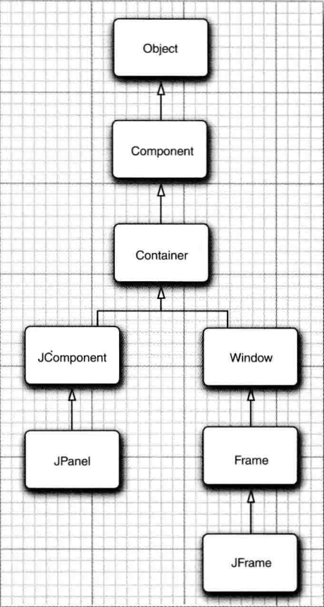

## Java Swing

### Frame



1. Frame has multiple components. Each component can be points, text, window, and shape.

2. We can extend our own frame and component from **JFrame and JComponent**

### JComponent

1. JComponent was defaultly **listened** by the JFrame. If the JComponent needs to be repaint, the JFrame would call the `paintComponent(Graphics g)` method of JComponent.
    ```Java
    class MyComponent extends Component{
        @Override
        public void paintComponent (Graphics g){
            // code for drawing
            Graphics2D g2 = (Graphics2D) g;
            // set color
            g2.setPaint(Color.PINK);
            g2.drawString ( "Not a Hello, World program" , MESSAGE_X , MESSACE_Y);
        }

        @Override
        public Dimension getPreferredSize() { return new Dimension (DEFAULT.WIDTH , DEFAULT.HEICHT); }
    }
    ```

2. Shape
    1. **Graphics2D** instead of Graphics object. `Craphics2D g 2 = ( Graphics2D ) g;`

    2. Construct Shape objects and draw them in `paintComponent()` method. We can choose the parameter type to be **float or double**
    ```Java
    Rectangle2D rect = new Rectangle2D.Double(lx, ly, width, height);
    g2.draw(rect);

    // draw the enclosed ellipse
    Ellipse2D e = new Ellipse2D.Double();
    e.setFrame(rect);
    g2.draw(e);

    ```

    3. Color. We can choose the color to draw the component. `g2.setPaint(Color.RED)`. Besides, we can set the background color of each component. `comp.setBackground(SystemColor.window)`

### Environment 

1. **GraphicsEnvironment** describes the graphics environment. `getLocalGraphicsEnvironment()` to obtain the object.
    
2. Font
    1. Get all the local available fonts.
    ```Java
    String [] fontNames = GraphicsEnvironment.getLocalGraphicsEnvi ronment().getAvailableFontFamilyNames() ;
    ```

    2. Construct own fonts. 
    ```java
    Font sansbold = new Font ("SansSerif", Font.BOLD, 14) ;
    
    g2.setFont(sansbold);
    g2.draw(...);
    ```


### Event

1. add listener to the event, then the listener would perform the according action.
    ```Java
    class ColorAction implements ActionListener{
        private Color backgroundColor;

        public ColorAction (Color c){
            backgroundColor = c;
        }

        public void actionPerformed(ActionEvent event){
            // set panel background color
        }
    }

    // construct action and button
    ColorAction yellowAction = new ColorAction(Color.Yellow);
    JButton yellowButton = new JButton("Yellow");

    // add listener
    yellowButton.addActionListener(yellowAction);
    
    ```

2. we can use lambda function to simplify the listener. **lambda expression can access and modify** the attributes of the *outside* object.
    ```Java
    JButton button = new JButton("Yellow");
    buttonPanel.add(button);

    // buttonPanel is an outside object to the lambda function
    button.addActionListener(event -> {
        buttonPanel.setBackground(backgroundColor);
    })

    ```

3. WindowListener is **interface** and WindowAdaptor is **abstract class**.
    ```Java
    class Terminator extends WindowAdaptor{
        public void windowClosing(WindowEvent e){
            if (user agrees)
                System.exit(0);
        }
    }
    ```

4. mouseEvent
    1. To check if other key was struck at the same time, we can use **key mask**
    ```Java
    if((event.getModifiersEx() & InputEvent.BUTTON3_DOWN_MASK) != 0){
        // right button is pressed at the same time
    }

    // double click, if count >= 2
    if ( current != null && event.getClickCount() >= 2);
        // do something
    ```

    2. **MouseMotionListener** is different from **MouseListener**. It only focuses on the motion of mouse.
        If the mouse is pressed while moving then it should be **mouseDragged()** otherthan **mouseMoved()**.

    3. Set mouse cursor type. 
    ```Java
    // use system default type
    if (find(event.getPoint()) == null)
        setCursor(Cursor.getDefaultCursor());
    else
        setCursor(Cursor.getPredefinedCursor(Cursor.CROSSHAIR_CURS0R));

    // self create type
    Toolkit tk = Toolkit.getDefaultToolkit();
    Image img = tk.getlmage("dynamite.gif");
    Cursor dynamiteCursor = tk.createCustomCursor (img ,new Point (10, 10) ,"dynamite stick") ;
    ```

### AWT Event Structure

1. All the event is inherented from `java.util.EventObject`. `AWT Event` is the parent of all the AWT's events.
    

2. The semetic events
    1. ActionEvent: Button, Menu, Text.
    2. AdjustmentEvent: Scroller
    3. ItemEvent: multiple choice
    4. KeyEvent, MouseEvent, MouseWheelEvent
    5. Focus Event: some component get or lose focused
    6. Window Event

3. Adaptor: FocusAdaptor, MouseMotionAdaptor, KeyAdaptor, WindowAdaptor, MouseAdaptor